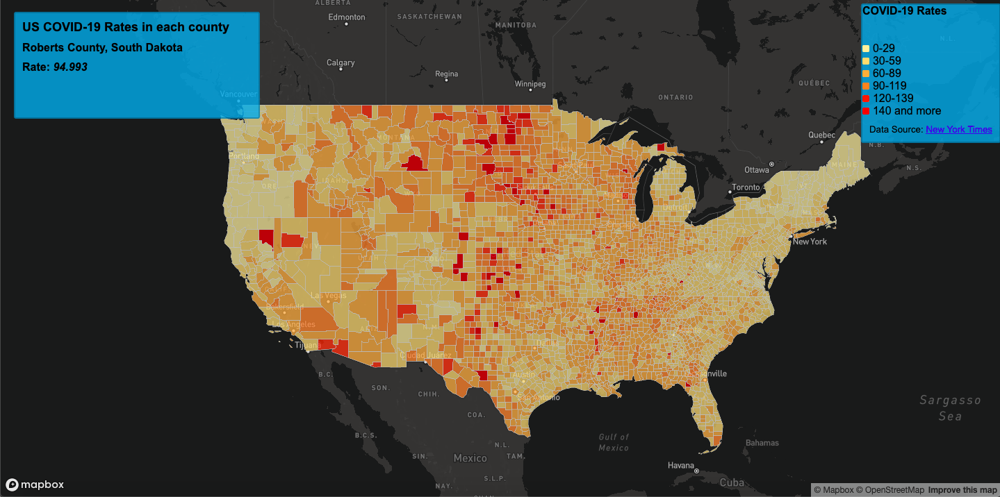
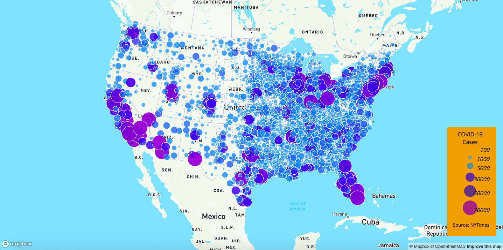

# Lab 3: Covid Maps
**Yuantai Li**

## Choropleth Map of Rates

In this experiment, I generated two maps by visualizing the data of COVID-19 in the United States in 2020. The two maps are choropleth Map and Proportional Symbols Map. The first **Choropleth map** was used to show the rates of COVID-19 among residents of each county in the United States. The rates were divided into six categories, with lighter colors representing lower rates and darker colors representing higher rates. On this map, viewers can interact with each other by moving the mouse over a particular area and seeing the name and rate of the selected county.

## Proportional Symbols Map of Cases
The second map is a **Proportional Symbols** map of the number of COVID-19 cases for each county in the United States. All the dots represent the estimated number of COVID-19 cases in the county in which they are located. The lighter the color, the smaller the dots, the fewer cases, and the darker the color, the larger the dots, the more cases. Users can click on the dot to interact with the map and see the selected county name and the exact number of COVID-19 cases in that area.

These two maps are created by VSCode html, the data is from the [The New York Times](https://github.com/nytimes/covid-19-data/blob/43d32dde2f87bd4dafbb7d23f5d9e878124018b8/live/us-counties.csv), the basemap is generated by mapbox, the shapefile data is from the The data include all the cases in 2020. The population data used for calculating the case rates are from the [the U.S. Census Bureau](https://www.census.gov/geographies/mapping-files/time-series/geo/carto-boundary-file.html)